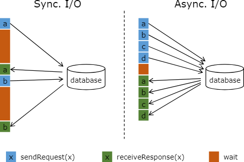

# Flink Async Function

## References
- [Flink Async I/O](https://nightlies.apache.org/flink/flink-docs-master/docs/dev/datastream/operators/asyncio/)
- [baeldung: Apache HttpClient](https://www.baeldung.com/tag/apache-httpclient)
- [Retrying Requests using Apache HttpClient](https://www.baeldung.com/java-retrying-requests-using-apache-httpclient)
- [Apache HttpClient 4x](https://hc.apache.org/httpcomponents-client-4.5.x/index.html)
- [Apache HttpClient HTTP connection managers](https://hc.apache.org/httpcomponents-client-4.5.x/current/tutorial/html/connmgmt.html#d5e374)
## What is the purpose of the project? 

- How to use the Async Function provided by Flink?
- How to use the Apache HttpClient4?
- How is the Async Function implemented with retry and timeout semantics?
- How to implement an asynchronous HTTP sink function in Flink using the Async Function and Apache HttpClient.

## Async Function 

Sync I/O vs Async I/O:



Async Function interfaces:

- AsyncFunction
- RichAsyncFunction

## HTTP Client

Apache HttpClient is an efficient, up-to-date, and feature-rich package implementing the client side of the most recent HTTP standards and recommendations. 

Here’s a simple example demonstrating how to use Apache HttpClient:

```java
try (CloseableHttpClient httpclient = HttpClientBuilder.create().build()) {
    // Please note that if response content is not fully consumed the underlying
    // connection cannot be safely re-used and will be shut down and discarded
    // by the connection manager. 
    var response = httpclient.execute( new HttpGet("http://path/to/xxx"));
    var statusCode = response.getStatusLine().getStatusCode();
    var responseData = response.getEntity();
    // Do something useful with the response body
    // and ensure it is fully consumed
    EntityUtils.consume(responseData);
}
```

### Configuration

Configrations is used to config the connection request operation.

```java
var requestConfig = RequestConfig.custom()
        // Determines the timeout in milliseconds until a connection is established.
        .setConnectTimeout(30000)
        // Defines the socket timeout (SO_TIMEOUT) in milliseconds, which is the timeout
        // for waiting for data or, put differently,
        // a maximum period inactivity between two consecutive data packets.
        .setSocketTimeout(60000)
        // Returns the timeout in milliseconds used when requesting a connection from
        // the connection manager.
        .setConnectionRequestTimeout(60000)
        // Determines whether redirects should be handled automatically.
        .setRedirectsEnabled(true)
        // Returns the maximum number of redirects to be followed.
        .setMaxRedirects(3)
        // Determines whether circular redirects (redirects to the same location) should
        // be allowed.
        .setCircularRedirectsAllowed(false)
        // Determines whether authentication should be handled automatically.
        .setAuthenticationEnabled(true)
        .build();

// Applies the requestConfig
HttpClientBuilder.create().setDefaultRequestConfig(requestConfig).build();
```

### HTTP Connection Managers

HTTP connections are complex, stateful, thread-unsafe objects which need to be properly managed to function correctly. HTTP connections can only be used by one execution thread at a time. HttpClient employs a special entity to manage access to HTTP connections called HTTP connection manager and represented by the HttpClientConnectionManager interface. The purpose of an HTTP connection manager is to serve as a factory for new HTTP connections, to manage life cycle of persistent connections and to synchronize access to persistent connections making sure that only one thread can have access to a connection at a time. 

**BasicHttpClientConnectionManager**

<u>A connection manager for a single connection.</u> This connection manager maintains only one active connection. Even though this class is fully thread-safe, it is designed for exclusive use by a single execution thread at a time, as only one thread can lease the connection at any given moment. 

BasicHttpClientConnectionManager will make an effort to reuse the connection for subsequent requests with the same route. It will, however, close the existing connection and re-open it for the given route, if the route of the persistent connection does not match that of the connection request. If the connection has been already been allocated, then java.lang.IllegalStateException is thrown.

**PoolingHttpClientConnectionManager**

<u>A connection manager maintians a pool of connections and is able to service connection requests from multiple execution threads.</u> Connections are pooled on a per route basis. A request for a route which already the manager has persistent connections for available in the pool will be services by leasing a connection from the pool rather than creating a brand new connection.

PoolingHttpClientConnectionManager maintains a maximum limit of connections on a per route basis and in total. Per default this implementation will create no more than 2 concurrent connections per given route and no more 20 connections in total. For many real-world applications these limits may prove too constraining, especially if they use HTTP as a transport protocol for their services.

This example shows how the connection pool parameters can be adjusted:
```java
// Set TTL to 5min.
// TTL defines maximum life span of persistent connections regardless of their
// expiration setting.
// No persistent connection will be re-used past its TTL value.
var manager = new PoolingHttpClientConnectionManager(5, TimeUnit.MINUTES);
// Dncrease max total connection from 20 to 10.
manager.setMaxTotal(10);
// Increase default max connection per route from 2 to 10.
// Since I'm always use the same route.
manager.setDefaultMaxPerRoute(10);
// Checks the connection if the elapsed time since
// the last use of the connection exceeds the timeout that has been set.
// Increase re-validated connection time from 2s to 5s.
manager.setValidateAfterInactivity(5000);

var httpClient = HttpClientBuilder
                .create()
                .setDefaultRequestConfig(requestConfig)
                .setConnectionManager(manager)
                .build();
```


### Retrying Requests 

**Default Retry Policy**

**Custom Retry Policy**

